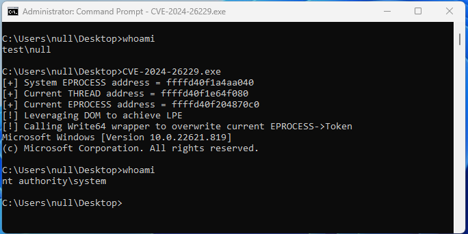

# CVE-2024-26229
CWE-781: Improper Address Validation in IOCTL with METHOD_NEITHER I/O Control Code in the csc.sys driver

## Acknowledgements

Credits to the Eric Egsgard and his talk at [OffensiveCon24](https://www.youtube.com/watch?v=2eHsnZ4BeDI)
